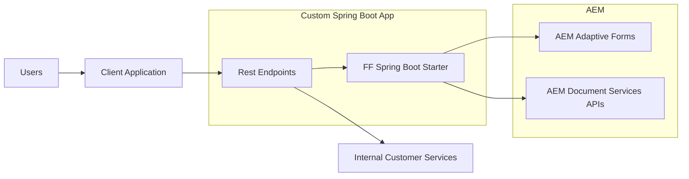
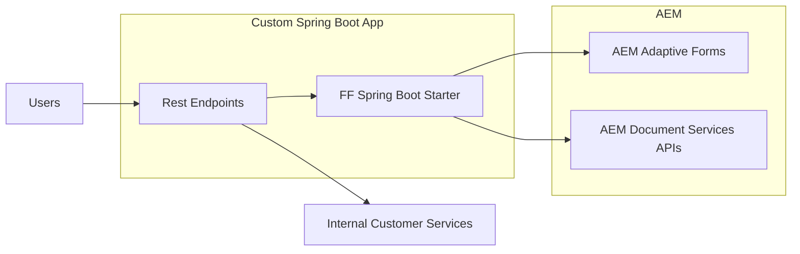
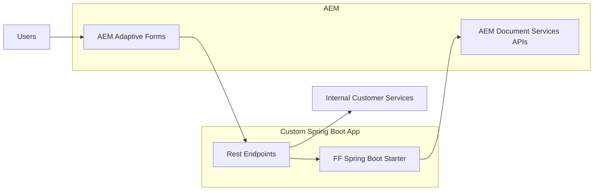
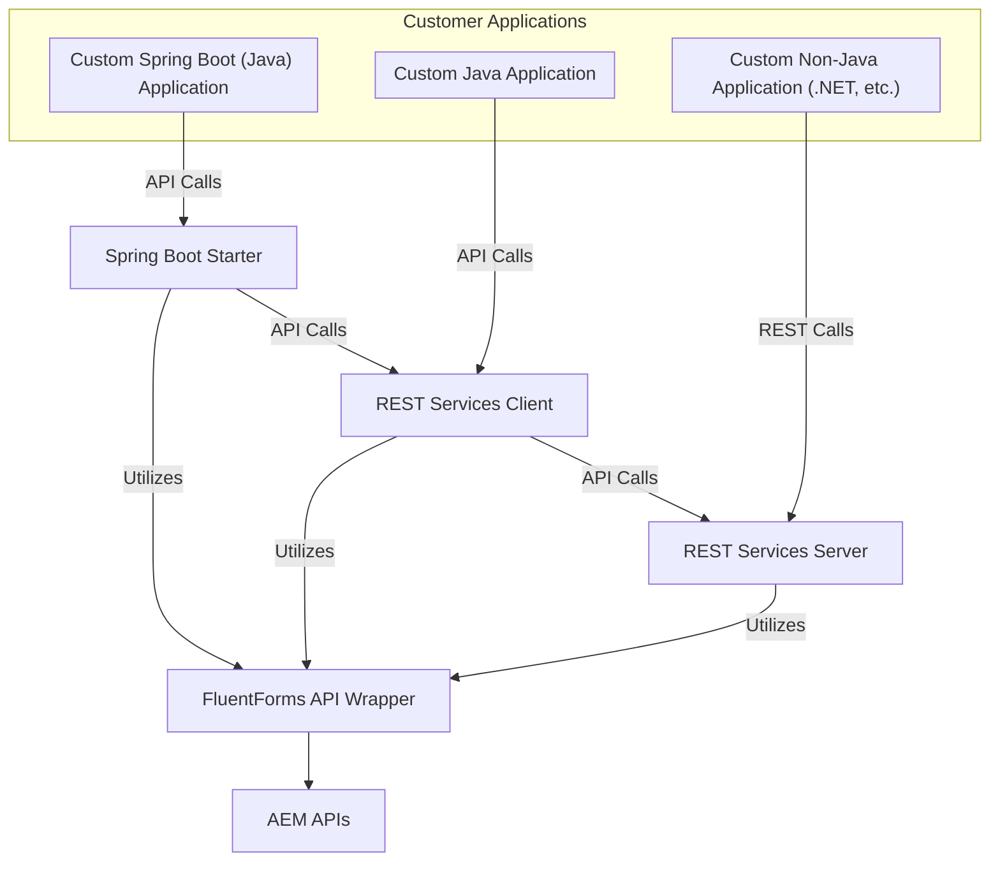

# Typical Architectures
## Client Application in Front

```mermaid
graph LR
    D[Users]-->CA[Client Application]
    subgraph sb[Custom Spring Boot App]
    RE[Rest Endpoints]-->SBS[FF Spring Boot Starter]
    end
    CA-->RE
    subgraph aem[AEM]
    AAF[AEM Adaptive Forms]
    AA[AEM Document Services APIs]
    end
    SBS-->AA
    SBS-->AAF
    RE-->ics[Internal Customer Services]
```
## Users Direct to Custom App

```mermaid
graph LR
    A[Users]-->RE
    subgraph sb[Custom Spring Boot App]
    RE[Rest Endpoints]-->SBS[FF Spring Boot Starter]
    end
    subgraph aem[AEM]
    AAF[AEM Adaptive Forms]
    AA[AEM Document Services APIs]
    end
    SBS-->AA
    SBS-->AAF
    RE-->ics[Internal Customer Services]
```
## Users Direct to AEM

```mermaid
graph LR
    A[Users]-->AAF
    subgraph sb[Custom Spring Boot App]
    RE[Rest Endpoints]-->SBS[FF Spring Boot Starter]
    end
    subgraph aem[AEM]
    AAF[AEM Adaptive Forms]
    AA[AEM Document Services APIs]
    end
    AAF-->RE
    SBS-->AA
    RE-->ics[Internal Customer Services]
```

# Internal (Layered) Archiecture

```mermaid
graph TD
    A[Spring Boot Starter]-->|API Calls|B[REST Services Client]
    B-->|API Calls|C[REST Services Server]
    A-->|Utilizes|D[FluentForms API Wrapper]
    B-->|Utilizes|D
    C-->|Utilizes|D
    D-->E[AEM APIs]
    subgraph APPS[Customer Applications]
        subgraph CSB["Custom Spring Boot (Java) Application"]
        end
        subgraph CJA[Custom Java Application]
        end
        subgraph COA["Custom Non-Java Application (.NET, etc.)"]
        end
    end
    CSB-->|API Calls|A
    CJA-->|API Calls|B
    COA-->|REST Calls|C
```

