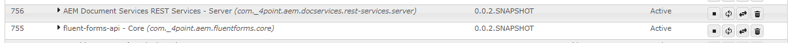

[](https://opensource.org/licenses/Apache-2.0)

# FluentForms API
[](https://github.com/4PointSolutions/FluentFormsAPI/actions/workflows/fluentforms-ci.yml)
[](https://github.com/4PointSolutions/FluentFormsAPI/actions/workflows/rest-services-ci.yml)
[](https://github.com/4PointSolutions/FluentFormsAPI/actions/workflows/spring-boot-webmvc-starter-ci.yml)
[](https://github.com/4PointSolutions/FluentFormsAPI/actions/workflows/spring-boot-jersey-starter-ci.yml)
[](https://github.com/4PointSolutions/FluentFormsAPI/actions/workflows/spring-sample-web-apps-ci.yml)

The FluentForms API project is a set of Java libraries that allow remote access to 
[Adobe Experience Manager Forms](https://experienceleague.adobe.com/docs/experience-manager-65/content/forms/getting-started/introduction-aem-forms.html?lang=en) (a.k.a. AEM Forms) 
functionality. 

In addition to providing remote access to AEM Forms functionality, it also provides a modern, typesafe, and [fluent](https://en.wikipedia.org/wiki/Fluent_interface) facade over the existing [AEM Forms APIs](https://developer.adobe.com/experience-manager/reference-materials/6-5/forms/javadocs/index.html).

It has a layered architecture with four layers. Each layer targets a different 
type of client application. Each layer is built upon the previous layers and requires less 
client code to use than the layers below it.  The top layer is the Spring Boot Starter.


## Spring Boot Starter

This is the easiest way to use the FluentForms integration with AEM.  The Spring Boot starter 
publishes Spring beans into the
Spring context that can be utilized easily by any Spring Boot application.

### Getting started with the Spring Boot starter

* Retrieve OSGi bundles and install into your AEM server
* Add starter to project using maven
* Add AEM code to your project

There is a [sample web application](spring/fluentforms-sample-webmvc-app) that uses the Spring Boot 
starter library.  There are also documents outlining the [Spring Beans provided by the 
starter library](spring/ConfigurationBeans.md)  and the [configuration properties](spring/ConfigurationProperties.md) that is uses.

The default starter uses Spring MVC to implement reverse proxy endpoints that forward requests to AEM and uses the Spring RestClient to make Document Services calls to AEM.  For backwards compatibility with previous releases that used [Eclipse Jersey](https://eclipse-ee4j.github.io/jersey/) for these two functions, a Jersey Spring Boot starter is also available.

The Jersey Spring Boot starter can be included in the project instead of the default starter.  This triggers the inclusion of Spring's `spring-boot-starter-jersey` and the fluent forms starter autoconfigures to use the older codebase that uses Jersey for proxying AEM and making calls to AEM Document Services.  See the [sample Jersey application](spring/fluentforms-sample-web-jersey-app) for the maven details.

## Java Client Library

 This is the targeted at customers with Java applications that are _not_ based on Spring Boot.

### Getting started with the Java Client Library

* Retrieve OSGi bundles and install into your AEM server
* Add client library to project using maven
* Add AEM code to your project


## AEM REST Services

This is targeted at customers with non-Java applications.

### Getting started with the AEM REST Services

* Retrieve OSGi bundles and install into your AEM server
* Make REST calls to the REST services

## Fluent Forms Core Libraries

This is used internally by the AEM Server REST Services but could be utilized by customers 
writing OSGi bundles in Java that will run directly on the AEM server.

### Getting started with the Fluent Forms Core Libraries
* Retrieve OSGi bundles and install into your AEM server
* Add AEM code to your project


# Retrieving the Fluent Forms OSGi Bundles

The bundles can either be built from source or retrieved from this project's [GitHub Packages 
Repository](https://github.com/orgs/4PointSolutions/packages?repo_name=FluentFormsAPI).  

There are a couple of ways to retrieve files from this project's GitHub Packages Repository. 
The GitHub Packages Repository is a maven repository that requires authentication, 
so both approaches require that you have a GitHub account and that you set up your 
GitHub credentials in your local maven `settings.xml` file (i.e. `~/.m2/settings.xml`).

To set up your maven credentials, create a `settings.xml` file within a `.m2` directory 
underneath your home directory.  The settings.xml file should look like this:

```xml
 <settings xmlns="http://maven.apache.org/SETTINGS/1.0.0"
      xmlns:xsi="http://www.w3.org/2001/XMLSchema-instance"
      xsi:schemaLocation="http://maven.apache.org/SETTINGS/1.0.0
                          https://maven.apache.org/xsd/settings-1.0.0.xsd">
      <servers>
        <server>
            <id>github</id>
            <username>your GitHub user name goes here</username>
            <password>your personal access token goes here</password>
        </server>
      </servers>
    </settings>
```

Both methods outlined below assume that the server's id is set to `github` as in the sample above.

The two common methods for retrieving the bundles are:

1. Use [JBang](https://www.jbang.dev/) and run the `GrabBundles.java` script located under the [jbang_scripts](FluentFormsAPI/jbang_scripts) directory.  

2. Use Maven to retrieve the artifacts using the Maven Dependency Plugin.

This is a sample maven pom.xml that accompilishes this task:
```xml
<?xml version="1.0" encoding="UTF-8"?>
<project xmlns="http://maven.apache.org/POM/4.0.0"
    xmlns:xsi="http://www.w3.org/2001/XMLSchema-instance"
    xsi:schemaLocation="http://maven.apache.org/POM/4.0.0 http://maven.apache.org/maven-v4_0_0.xsd">
    <modelVersion>4.0.0</modelVersion>
    <groupId>com._4point.aem</groupId>
    <artifactId>fluentforms-get</artifactId>
    <packaging>pom</packaging>
    <version>0.0.1-SNAPSHOT</version>
    <name>Retreive FluentForms bundles</name>
    <description>Retreive FluentForms bundles from GitHub Package Repository</description>
 
 	<build>
		<plugins>
			<plugin>
				<groupId>org.apache.maven.plugins</groupId>
				<artifactId>maven-dependency-plugin</artifactId>
				<version>3.6.0</version>
				<executions>
					<execution>
						<id>get_fluentforms_core</id>
						<phase>package</phase>
						<goals>
							<goal>get</goal>
						</goals>
						<configuration>
							<artifact>com._4point.aem:fluentforms.core:0.0.3-SNAPSHOT</artifact>
							<remoteRepositories>
								github::::https://maven.pkg.github.com/4PointSolutions/FluentFormsAPI
							</remoteRepositories>
							<packaging>jar</packaging>
						</configuration>
					</execution>
					<execution>
						<id>get_restservices_server</id>
						<phase>package</phase>
						<goals>
							<goal>get</goal>
						</goals>
						<configuration>
							<artifact>com._4point.aem.docservices:rest-services.server:0.0.3-SNAPSHOT</artifact>
							<remoteRepositories>
								github::::https://maven.pkg.github.com/4PointSolutions/FluentFormsAPI
							</remoteRepositories>
							<packaging>jar</packaging>
						</configuration>
					</execution>
					<execution>
						<id>copy</id>
						<phase>package</phase>
						<goals>
							<goal>copy</goal>
						</goals>
						<configuration>
							<artifactItems>
								<artifactItem>
									<groupId>com._4point.aem</groupId>
									<artifactId>fluentforms.core</artifactId>
									<version>0.0.3-SNAPSHOT</version>
									<type>jar</type>
									<overWrite>true</overWrite>
								</artifactItem>
								<artifactItem>
									<groupId>com._4point.aem.docservices</groupId>
									<artifactId>rest-services.server</artifactId>
									<version>0.0.3-SNAPSHOT</version>
									<type>jar</type>
									<overWrite>true</overWrite>
								</artifactItem>
							</artifactItems>
						</configuration>
					</execution>
				</executions>
			</plugin>
		</plugins>
	</build>
</project>
```

After executing `mnv package` the files should be available in the `target\dependency` dependency under 
the directory where the pom.xml resides.

# Deploying the Fluent Forms OSGi Bundles

The easiest way to install the Fluent Forms OSGi bundles is to copy them to AEM's 
`crx-quickstart/install` directory (this directory is not created by default, so 
you may have to create the directory before copying the bundles into it).  AEM
monitors this directory and when the bundle .jar files are copied there, it will detect 
and install them.

You can verify that the bundles are installed and running by locating them in the OSGi 
bundles console (located under `http://<machine>:<port>/system/console/bundles`).  Both bundles 
should be present with a status of  `Active`:

